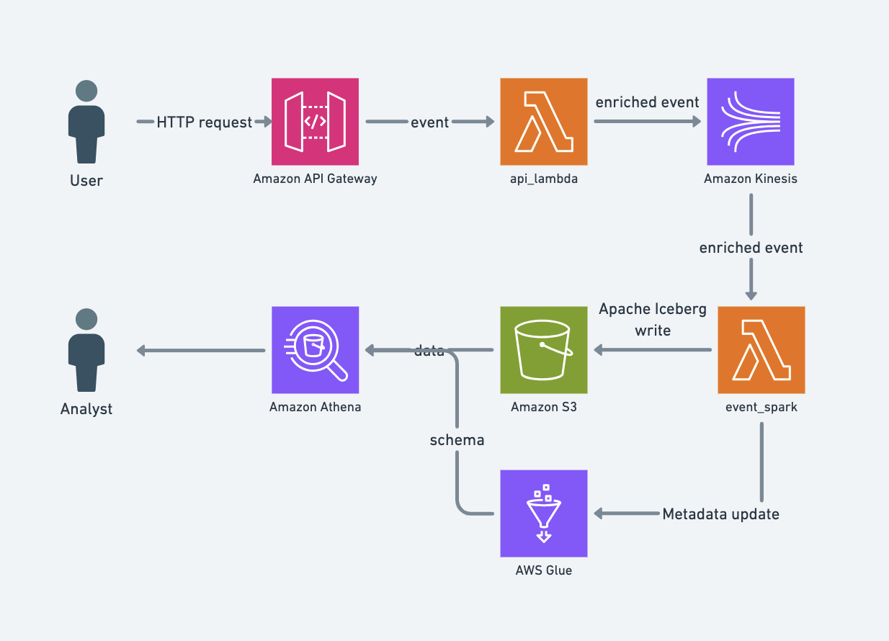

# ManyMetrics

ManyMetrics is an open-source event tracking infrastructure:

- API based on AWS API Gateway and lambda
- Storage in AWS S3 in the [Apache Iceberg](https://iceberg.apache.org/) format
- SQL access to data via AWS Athena
- A JS client library

## Components

