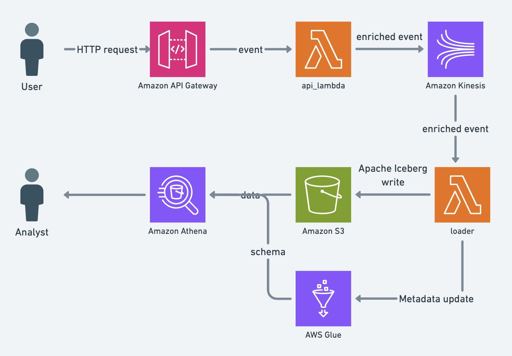

# ManyMetrics

ManyMetrics is an open-source event tracking infrastructure based on AWS. The infrastructure is
provisioned using terraform, which sets up the following resources:

- API powered by API Gateway and Lambda
- S3 storage in the [Apache Iceberg](https://iceberg.apache.org/) format
- AWS Athena for SQL-based data access
- A JavaScript client library

ManyMetrics provides a cost-effective analytics solution that keeps data in your cloud account, allowing you to pay only for what you use. The code is licensed under the MIT license.

## Components



## Deploy and track events

ManyMetrics uses terraform for setting up resources in an AWS account.

1. Confgiure AWS access in your terminal
2. Run the following command

    ```
    cd sample
    terraform apply
    ```

    This command should
    - Create ECR repositories
    - Build and upload docker images
    - Create other AWS resources like API Gateway and Lambdas
3. Run `terraform output` - you will need the values from the output in a few steps below
4. Update `browser_sdk_url/sample.html` with the values from the `api_instance_url` and `browser_sdk_url` outputs
5. Render a sample page with enabled tracking
```
cd browser-sdk
python3 -m http.server 8000
open http://0.0.0.0:8000/
```
6. Open development tools in your browser and watch events being sent to the API when clicking buttons
7. Open Athena in AWS Console (use the AWS region where you deployed ManyMetrics to) and select the database from the `glue_database_name` output
8. Run the query to see the events `select * from events;`. You should see the events


## Approximate monthly cost of running

The calculations below do not include S3 storage and a few others costs like network costs but they should be relatively small.

| Service | Cost | 1kk events | 10kk events | 100kk events |
| ------- | ---- | ------- | -------- | --------- |
| API Gateway | $1 per 1kk req | $1 | $10 | $100 |
| Lambda | $0.0000000167 per ms <sup>[1]</sup> | $0.10 | $1 | $10 |
| Kinesis | $0.015 per hour <sup>[2]</sup> | $10.8 | $10.8 | $10.8 |
| Total | | $11.9 | $21.8 | $120.8 |

1. Assumes that 10,000 messages are processed in roughly 1 min by Spark in Lambda.
2. One shard of provisioned Kinesis, more shards might be required for spiky workloads.

## Development

Use [pre-commit](https://pre-commit.com/).

```
pip install pre-commit
pre-commit
```
